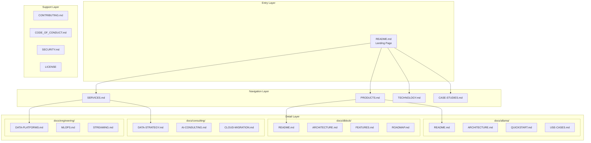

# Design Document: DigiTransLab Documentation Repository

## Overview

This design document outlines the technical architecture and implementation approach for the DigiTransLab GitHub documentation repository. The repository serves as the organisation's primary documentation hub, featuring a hierarchical structure of markdown files, visual assets, and GitHub automation configurations.

The design prioritises:
- **Discoverability**: Clear navigation and cross-linking between documents
- **Visual Appeal**: Consistent branding with badges, diagrams, and formatted content
- **Maintainability**: Modular structure allowing independent updates to sections
- **Automation**: GitHub workflows for quality assurance

## Architecture

The repository follows a layered documentation architecture:



### Directory Structure

```
digitranslab/
├── README.md                    # Entry point - organisation overview
├── PRODUCTS.md                  # Product catalogue with links to detail docs
├── SERVICES.md                  # Service offerings overview
├── TECHNOLOGY.md                # Technology stack and expertise
├── CASE-STUDIES.md              # Success stories and outcomes
├── CONTRIBUTING.md              # Contribution guidelines
├── CODE_OF_CONDUCT.md           # Community standards
├── SECURITY.md                  # Security policy
├── LICENSE                      # MIT or Apache 2.0 licence
│
├── docs/                        # Detailed documentation
│   ├── allama/                  # Allama product docs
│   ├── dblock/                  # DBLOCK product docs
│   ├── consulting/              # Consulting service docs
│   └── engineering/             # Engineering service docs
│
├── assets/                      # Visual resources
│   ├── images/                  # PNG/JPG images
│   └── diagrams/                # SVG diagrams
│
└── .github/                     # GitHub configuration
    ├── ISSUE_TEMPLATE/          # Issue templates
    ├── PULL_REQUEST_TEMPLATE.md # PR template
    └── workflows/               # GitHub Actions
```

## Components and Interfaces

### Component 1: Landing Page (README.md)

The main entry point providing organisation overview and navigation.

**Structure:**
```markdown
# Header Section
- Banner image (assets/images/banner.png)
- Organisation name and tagline
- Social badges (Website, Discord, LinkedIn, GitHub)

# Metrics Section
- Key statistics displayed as badges or formatted blocks
- Years, clients, projects, data volume, events

# About Section
- Organisation description
- Focus areas and value proposition

# Products Section
- Product cards with brief descriptions
- Links to detailed documentation

# Services Section
- Service category overview
- Links to service documentation

# Technology Section
- Technology stack badges
- Link to detailed technology page

# Quick Links Section
- Navigation to all major sections
- External links (website, social)

# Footer Section
- Licence information
- Contact details
```

**Badge Format:**
```markdown
[](https://digitranslab.com)
[](https://discord.com/invite/2mK6h9rp)
```

### Component 2: Product Documentation Module

Structured documentation for each product following a consistent template.

**Allama Documentation Structure:**
| File | Purpose | Key Sections |
|------|---------|--------------|
| README.md | Product overview | Features, benefits, quick links |
| ARCHITECTURE.md | Technical design | System diagram, components, data flow |
| QUICKSTART.md | Getting started | Installation, configuration, first steps |
| USE-CASES.md | Practical examples | Security automation scenarios |

**DBLOCK Documentation Structure:**
| File | Purpose | Key Sections |
|------|---------|--------------|
| README.md | Product overview | Features, benefits, status badge |
| ARCHITECTURE.md | Technical design | Pipeline architecture, components |
| FEATURES.md | Feature breakdown | Detailed feature descriptions |
| ROADMAP.md | Future plans | Timeline, planned features |

### Component 3: Service Documentation Module

Documentation for consulting and engineering services.

**Consulting Services:**
| File | Content |
|------|---------|
| DATA-STRATEGY.md | Data governance, strategy frameworks, maturity assessment |
| AI-CONSULTING.md | AI readiness, use case identification, implementation planning |
| CLOUD-MIGRATION.md | Migration assessment, architecture design, execution support |

**Engineering Services:**
| File | Content |
|------|---------|
| DATA-PLATFORMS.md | Platform design, implementation, Databricks/Snowflake expertise |
| MLOPS.md | ML pipeline design, model deployment, monitoring |
| STREAMING.md | Real-time pipelines, Kafka/Flink implementation |

### Component 4: Asset Management System

Organised visual resources supporting documentation.

**Image Assets:**
```
assets/images/
├── logo-dark.png          # 400x100px, transparent background
├── logo-light.png         # 400x100px, transparent background
├── banner.png             # 1280x640px, branded header
├── allama-screenshot.png  # Product screenshot/mockup
├── dblock-screenshot.png  # Product screenshot/mockup
├── architecture-diagram.png
├── medallion-architecture.png
└── tech-stack.png
```

**SVG Diagrams:**
```
assets/diagrams/
├── data-platform-architecture.svg  # Mermaid-generated
├── allama-workflow.svg             # Security automation flow
├── dblock-pipeline.svg             # Data pipeline flow
└── consulting-process.svg          # Engagement methodology
```

### Component 5: GitHub Template System

Standardised templates for community interaction.

**Issue Templates:**

*Bug Report Template:*
```yaml
name: 🐛 Bug Report
description: Report a bug or issue
labels: ["bug", "triage"]
body:
  - type: textarea
    id: description
    attributes:
      label: Bug Description
      description: Clear description of the bug
    validations:
      required: true
  - type: textarea
    id: reproduction
    attributes:
      label: Steps to Reproduce
  - type: textarea
    id: expected
    attributes:
      label: Expected Behaviour
```

*Feature Request Template:*
```yaml
name: ✨ Feature Request
description: Suggest a new feature
labels: ["enhancement"]
body:
  - type: textarea
    id: problem
    attributes:
      label: Problem Description
    validations:
      required: true
  - type: textarea
    id: solution
    attributes:
      label: Proposed Solution
```

**Pull Request Template:**
```markdown
## Description
[Describe your changes]

## Type of Change
- [ ] Documentation update
- [ ] Bug fix
- [ ] New feature
- [ ] Breaking change

## Checklist
- [ ] I have read the CONTRIBUTING guidelines
- [ ] My changes follow the style guidelines
- [ ] I have checked for spelling/grammar errors
- [ ] All links are valid
```

### Component 6: GitHub Actions Workflow

Automated quality assurance for documentation.

**Link Checker Workflow:**
```yaml
name: Check Links

on:
  push:
    branches: [main]
  pull_request:
    branches: [main]
  schedule:
    - cron: '0 0 * * 0'  # Weekly

jobs:
  check-links:
    runs-on: ubuntu-latest
    steps:
      - uses: actions/checkout@v4
      - name: Link Checker
        uses: lycheeverse/lychee-action@v1
        with:
          args: --verbose --no-progress './**/*.md'
          fail: true
```

## Data Models

### Document Metadata Model

Each markdown document follows a consistent structure:

```typescript
interface DocumentMetadata {
  title: string;           // Document title (H1)
  description: string;     // Brief description
  navigation: {
    parent: string;        // Link to parent document
    siblings: string[];    // Related documents at same level
    children: string[];    // Sub-documents
  };
  lastUpdated: string;     // ISO date string
}
```

### Badge Configuration Model

```typescript
interface BadgeConfig {
  label: string;           // Badge label text
  message: string;         // Badge message/value
  color: string;           // Hex colour code
  style: 'for-the-badge' | 'flat-square';
  logo?: string;           // Optional logo name
  logoColor?: string;      // Logo colour
  link?: string;           // Click destination URL
}

// Example configurations
const socialBadges: BadgeConfig[] = [
  {
    label: 'Website',
    message: 'digitranslab.com',
    color: '8B5CF6',
    style: 'for-the-badge',
    logo: 'safari',
    logoColor: 'white',
    link: 'https://digitranslab.com'
  },
  {
    label: 'Discord',
    message: 'Join Us',
    color: '5865F2',
    style: 'for-the-badge',
    logo: 'discord',
    logoColor: 'white',
    link: 'https://discord.com/invite/2mK6h9rp'
  }
];
```

### Product Information Model

```typescript
interface Product {
  name: string;
  tagline: string;
  status: 'available' | 'coming-soon' | 'beta';
  repositoryUrl: string;
  features: string[];
  benefits: string[];
  documentation: {
    overview: string;      // Path to README
    architecture: string;  // Path to ARCHITECTURE.md
    additionalDocs: string[];
  };
}

const products: Product[] = [
  {
    name: 'Allama',
    tagline: 'AI Security Automation',
    status: 'available',
    repositoryUrl: 'https://github.com/digitranslab/allama',
    features: ['Visual Workflows', 'AI Triage', '80+ Integrations', 'Self-Hosted'],
    benefits: [
      'Reduce incident response time by 90%',
      'Automate repetitive security tasks',
      'Full control with self-hosted deployment'
    ],
    documentation: {
      overview: 'docs/allama/README.md',
      architecture: 'docs/allama/ARCHITECTURE.md',
      additionalDocs: ['docs/allama/QUICKSTART.md', 'docs/allama/USE-CASES.md']
    }
  },
  {
    name: 'DBLOCK',
    tagline: 'Data Workflow Automation',
    status: 'coming-soon',
    repositoryUrl: 'https://github.com/digitranslab/dblock',
    features: ['Visual Editor', 'AI Assistant', '100+ Connectors', 'Real-Time Streaming'],
    benefits: [
      'Self-service analytics',
      'No-code data pipelines',
      'Enterprise-grade scalability'
    ],
    documentation: {
      overview: 'docs/dblock/README.md',
      architecture: 'docs/dblock/ARCHITECTURE.md',
      additionalDocs: ['docs/dblock/FEATURES.md', 'docs/dblock/ROADMAP.md']
    }
  }
];
```

### Service Information Model

```typescript
interface Service {
  category: 'consulting' | 'engineering';
  name: string;
  description: string;
  offerings: string[];
  industries: Industry[];
  documentationPath: string;
}

interface Industry {
  name: string;
  useCases: string[];
}

const industries: Industry[] = [
  {
    name: 'Financial Services',
    useCases: ['Risk analytics', 'Fraud detection', 'Regulatory compliance']
  },
  {
    name: 'Healthcare',
    useCases: ['Patient insights', 'Clinical analytics', 'Operational efficiency']
  },
  {
    name: 'Retail & E-commerce',
    useCases: ['Customer 360', 'Demand forecasting', 'Personalisation']
  },
  {
    name: 'Technology',
    useCases: ['Product analytics', 'User behaviour', 'Platform optimisation']
  },
  {
    name: 'Manufacturing',
    useCases: ['Predictive maintenance', 'Supply chain', 'Quality analytics']
  }
];
```

### Metrics Display Model

```typescript
interface Metric {
  label: string;
  value: string;
  icon: string;
  description?: string;
}

const organisationMetrics: Metric[] = [
  { label: 'Years of Experience', value: '10+', icon: '📅' },
  { label: 'Clients Served', value: '150+', icon: '🤝' },
  { label: 'Projects Delivered', value: '500+', icon: '🚀' },
  { label: 'Data Processed', value: '50+ PB', icon: '💾' },
  { label: 'Events Daily', value: '1B+', icon: '⚡' }
];
```


## Correctness Properties

*A property is a characteristic or behaviour that should hold true across all valid executions of a system—essentially, a formal statement about what the system should do. Properties serve as the bridge between human-readable specifications and machine-verifiable correctness guarantees.*

Based on the prework analysis, the following properties have been identified for validation:

### Property 1: Navigation Link Consistency

*For any* markdown file in the docs/ directory, the file SHALL contain at least one navigation link back to the main README.md or parent document.

**Validates: Requirements 1.6**

### Property 2: British English Spelling Consistency

*For any* markdown file in the repository, all text content SHALL use British English spelling conventions (e.g., "colour" not "color", "organisation" not "organization", "behaviour" not "behavior").

**Validates: Requirements 2.7, 9.1**

### Property 3: Industry Use Case Coverage

*For any* industry mentioned in the service documentation, there SHALL be at least one specific use case documented for that industry.

**Validates: Requirements 4.4**

### Property 4: Diagram Format Validity

*For any* SVG file in the assets/diagrams/ directory, the file SHALL contain either valid Mermaid syntax (rendered) or valid SVG markup.

**Validates: Requirements 6.6**

### Property 5: Badge Format Consistency

*For any* shields.io badge in the documentation, the badge SHALL follow the style guidelines: main/prominent badges use `style=for-the-badge` and inline badges use `style=flat-square`, with colours from the approved palette (#8B5CF6, #3B82F6, or standard logo colours).

**Validates: Requirements 9.2, 9.3**

### Property 6: Table of Contents in Long Documents

*For any* markdown document exceeding 200 lines, the document SHALL include a table of contents section with anchor links to major sections.

**Validates: Requirements 9.7**

### Property 7: Case Study Structure Completeness

*For any* case study entry in CASE-STUDIES.md, the entry SHALL contain three distinct sections: Challenge, Solution, and Results.

**Validates: Requirements 10.3**

## Error Handling

### Missing Asset References

When a markdown file references an image or diagram that doesn't exist:
- The link checker workflow will flag the broken reference
- Documentation should use relative paths from the repository root
- Placeholder images should be created for any referenced but missing assets

### Invalid Link Detection

When internal or external links are broken:
- The GitHub Actions workflow runs on push, PR, and weekly schedule
- Failed link checks will block PR merges (configurable)
- External links should be validated but may have transient failures

### Template Validation

When issue or PR templates have syntax errors:
- GitHub will fall back to default templates
- YAML syntax should be validated before committing
- Template previews should be tested in GitHub UI

## Testing Strategy

### Dual Testing Approach

This documentation repository requires both unit tests (specific examples) and property tests (universal properties) for comprehensive validation.

**Unit Tests** verify specific examples and edge cases:
- File existence checks for required documents
- Content validation for specific required text
- Structure validation for templates

**Property Tests** verify universal properties across all inputs:
- Navigation consistency across all documentation files
- Spelling consistency across all text content
- Format consistency across all badges and diagrams

### Property-Based Testing Configuration

**Testing Library:** For markdown/documentation validation, use a combination of:
- Shell scripts with grep/awk for text pattern matching
- Node.js with `fast-check` for property-based testing of content patterns
- GitHub Actions for automated validation

**Test Configuration:**
- Minimum 100 iterations per property test (where applicable)
- Each property test must reference its design document property
- Tag format: **Feature: digitranslab-docs, Property {number}: {property_text}**

### Test Categories

| Category | Type | Coverage |
|----------|------|----------|
| File Structure | Unit | Requirements 1.1-1.5, 6.1-6.5, 7.1-7.6 |
| Content Validation | Unit | Requirements 2.1-2.6, 3.1-3.8, 5.1-5.4 |
| Navigation Links | Property | Requirement 1.6 |
| British English | Property | Requirements 2.7, 9.1 |
| Badge Formatting | Property | Requirements 9.2, 9.3 |
| Case Study Structure | Property | Requirement 10.3 |
| Link Validation | Automated | Requirement 8.6 |

### Validation Scripts

**Structure Validation Script:**
```bash
#!/bin/bash
# Validates required file structure exists

required_files=(
  "README.md"
  "PRODUCTS.md"
  "SERVICES.md"
  "TECHNOLOGY.md"
  "CASE-STUDIES.md"
  "CONTRIBUTING.md"
  "CODE_OF_CONDUCT.md"
  "SECURITY.md"
  "LICENSE"
)

for file in "${required_files[@]}"; do
  if [[ ! -f "$file" ]]; then
    echo "FAIL: Missing required file: $file"
    exit 1
  fi
done

echo "PASS: All required files present"
```

**British English Validation:**
```bash
#!/bin/bash
# Checks for American English spellings that should be British

american_spellings=("color" "organization" "behavior" "center" "analyze" "optimize")
british_spellings=("colour" "organisation" "behaviour" "centre" "analyse" "optimise")

for file in $(find . -name "*.md" -type f); do
  for spelling in "${american_spellings[@]}"; do
    if grep -qi "\b${spelling}\b" "$file"; then
      echo "WARN: American spelling '$spelling' found in $file"
    fi
  done
done
```

### Automated Validation via GitHub Actions

The link checker workflow provides continuous validation:
- Runs on every push to main branch
- Runs on every pull request
- Runs weekly to catch external link rot
- Reports broken links with file and line number
