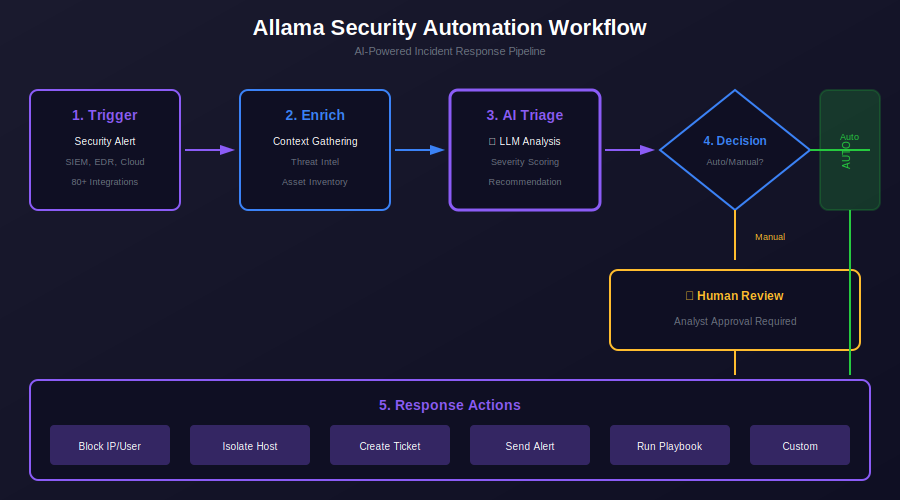

# 🏗️ Allama Architecture

<p align="center">
  
  
</p>

<p align="center">
  <a href="../../README.md">🏠 Home</a> •
  <a href="../../PRODUCTS.md">📦 Products</a> •
  <a href="README.md">📖 Overview</a> •
  <a href="QUICKSTART.md">🚀 Quick Start</a> •
  <a href="USE-CASES.md">📋 Use Cases</a>
</p>

---

## Overview

This document describes the system architecture of **Allama**, DigiTransLab's AI-powered security automation platform. Allama is designed with a modular, scalable architecture that enables security teams to automate incident response, threat detection, and security operations workflows.

---

## 📊 System Architecture Diagram

<p align="center">
  
</p>

<p align="center">
  <em>Figure 1: Allama System Architecture and Workflow</em>
</p>

---

## 🧩 System Components

Allama consists of several interconnected components that work together to provide comprehensive security automation capabilities:

### Core Components

| Component | Description |
|-----------|-------------|
| **Workflow Engine** | The central orchestration layer that executes security automation playbooks. Manages workflow state, handles branching logic, and coordinates actions across integrated systems. |
| **AI Triage Module** | Intelligent alert processing system that analyses incoming security events, prioritises threats based on severity and context, and routes alerts to appropriate workflows. |
| **Integration Hub** | Manages connections to 80+ external security tools and platforms. Provides standardised interfaces for SIEMs, EDRs, ticketing systems, and cloud platforms. |
| **Visual Workflow Designer** | Drag-and-drop interface for creating and modifying security automation playbooks without coding. Supports complex branching, conditions, and parallel execution. |

### Supporting Components

| Component | Description |
|-----------|-------------|
| **Event Collector** | Ingests security events from multiple sources including SIEMs, cloud platforms, and endpoint detection systems. Normalises data into a consistent format. |
| **Action Executor** | Executes automated response actions such as blocking IPs, isolating endpoints, creating tickets, and sending notifications. |
| **Audit Logger** | Records all system activities, workflow executions, and user actions for compliance and forensic analysis. |
| **Configuration Manager** | Manages system settings, integration credentials, and workflow configurations with secure storage. |

---

## 🔄 Data Flow

The following describes how data flows through the Allama system from initial event ingestion to automated response:

### 1. Event Ingestion

```
┌─────────────────────────────────────────────────────────────────┐
│                        Event Sources                             │
├─────────────┬─────────────┬─────────────┬─────────────┬─────────┤
│    SIEM     │     EDR     │   Cloud     │  Ticketing  │  Custom │
│  (Splunk,   │ (CrowdStrike│   (AWS,     │   (Jira,    │   APIs  │
│   Elastic)  │  SentinelOne│   Azure)    │ ServiceNow) │         │
└──────┬──────┴──────┬──────┴──────┬──────┴──────┬──────┴────┬────┘
       │             │             │             │           │
       └─────────────┴─────────────┴─────────────┴───────────┘
                                   │
                                   ▼
                        ┌─────────────────────┐
                        │   Event Collector   │
                        │  (Normalisation)    │
                        └──────────┬──────────┘
                                   │
                                   ▼
```

Security events are collected from various sources through the **Event Collector**, which normalises data into a consistent format for processing.

### 2. AI Triage and Prioritisation

```
                        ┌─────────────────────┐
                        │   AI Triage Module  │
                        ├─────────────────────┤
                        │ • Threat Analysis   │
                        │ • Priority Scoring  │
                        │ • Context Enrichment│
                        │ • Alert Correlation │
                        └──────────┬──────────┘
                                   │
                    ┌──────────────┼──────────────┐
                    │              │              │
                    ▼              ▼              ▼
              ┌──────────┐  ┌──────────┐  ┌──────────┐
              │  High    │  │  Medium  │  │   Low    │
              │ Priority │  │ Priority │  │ Priority │
              └────┬─────┘  └────┬─────┘  └────┬─────┘
                   │             │             │
```

The **AI Triage Module** analyses incoming events, assigns priority scores, enriches alerts with contextual information, and correlates related events.

### 3. Workflow Execution

```
                        ┌─────────────────────┐
                        │   Workflow Engine   │
                        ├─────────────────────┤
                        │ • Playbook Selection│
                        │ • State Management  │
                        │ • Parallel Execution│
                        │ • Error Handling    │
                        └──────────┬──────────┘
                                   │
                    ┌──────────────┼──────────────┐
                    │              │              │
                    ▼              ▼              ▼
              ┌──────────┐  ┌──────────┐  ┌──────────┐
              │ Automated│  │  Human   │  │ Escalation│
              │ Response │  │ Decision │  │  Actions  │
              └──────────┘  └──────────┘  └──────────┘
```

The **Workflow Engine** selects appropriate playbooks based on event type and priority, manages execution state, and coordinates automated responses.

### 4. Action Execution

```
                        ┌─────────────────────┐
                        │   Action Executor   │
                        ├─────────────────────┤
                        │ • Block/Allow IPs   │
                        │ • Isolate Endpoints │
                        │ • Create Tickets    │
                        │ • Send Notifications│
                        │ • Update Systems    │
                        └──────────┬──────────┘
                                   │
                    ┌──────────────┼──────────────┐
                    │              │              │
                    ▼              ▼              ▼
              ┌──────────┐  ┌──────────┐  ┌──────────┐
              │ Security │  │ Ticketing│  │  Comms   │
              │  Tools   │  │ Systems  │  │ Channels │
              └──────────┘  └──────────┘  └──────────┘
```

The **Action Executor** carries out response actions across integrated systems, including security tools, ticketing platforms, and communication channels.

---

## 🔗 Integration Architecture

Allama's **Integration Hub** provides connectivity to 80+ security tools and platforms:

### Integration Categories

<p align="center">
  
  
  
</p>

| Category | Integrations | Purpose |
|----------|--------------|---------|
| **SIEM** | Splunk, Elastic, QRadar, Microsoft Sentinel | Event ingestion and correlation |
| **EDR** | CrowdStrike, Carbon Black, SentinelOne | Endpoint detection and response |
| **Ticketing** | Jira, ServiceNow, PagerDuty | Incident management and tracking |
| **Cloud** | AWS, Azure, GCP | Cloud security monitoring |
| **Identity** | Okta, Azure AD, CyberArk | Identity and access management |
| **Threat Intel** | VirusTotal, AlienVault, MISP | Threat intelligence enrichment |

### Integration Patterns

```
┌─────────────────────────────────────────────────────────────────┐
│                       Integration Hub                            │
├─────────────────────────────────────────────────────────────────┤
│                                                                  │
│  ┌─────────────┐  ┌─────────────┐  ┌─────────────┐              │
│  │   REST API  │  │  Webhooks   │  │   Polling   │              │
│  │  Connector  │  │  Listener   │  │   Agent     │              │
│  └──────┬──────┘  └──────┬──────┘  └──────┬──────┘              │
│         │                │                │                      │
│         └────────────────┼────────────────┘                      │
│                          │                                       │
│                          ▼                                       │
│                 ┌─────────────────┐                              │
│                 │  Normalisation  │                              │
│                 │     Layer       │                              │
│                 └─────────────────┘                              │
│                                                                  │
└─────────────────────────────────────────────────────────────────┘
```

---

## 🏠 Deployment Architecture

Allama supports **self-hosted deployment** for complete data control and compliance:

### Deployment Options

| Option | Description | Use Case |
|--------|-------------|----------|
| **Single Node** | All components on one server | Development, small teams |
| **High Availability** | Redundant components across nodes | Production environments |
| **Kubernetes** | Container orchestration deployment | Enterprise scale |

### Infrastructure Requirements

<details>
<summary><strong>📋 Minimum Requirements</strong></summary>

| Resource | Specification |
|----------|---------------|
| **CPU** | 4 cores |
| **Memory** | 16 GB RAM |
| **Storage** | 100 GB SSD |
| **Network** | 1 Gbps |
| **OS** | Linux (Ubuntu 20.04+, RHEL 8+) |

</details>

<details>
<summary><strong>📋 Recommended Requirements (Production)</strong></summary>

| Resource | Specification |
|----------|---------------|
| **CPU** | 8+ cores |
| **Memory** | 32+ GB RAM |
| **Storage** | 500+ GB SSD |
| **Network** | 10 Gbps |
| **OS** | Linux (Ubuntu 22.04, RHEL 9) |

</details>

---

## 🔒 Security Architecture

Allama is built with security-first principles:

### Security Features

| Feature | Description |
|---------|-------------|
| **Encryption at Rest** | All sensitive data encrypted using AES-256 |
| **Encryption in Transit** | TLS 1.3 for all network communications |
| **Role-Based Access Control** | Granular permissions for users and teams |
| **Audit Logging** | Comprehensive logging of all system activities |
| **Secrets Management** | Secure storage for integration credentials |
| **SSO Integration** | Support for SAML 2.0 and OIDC authentication |

---

## 📖 Related Documentation

| Document | Description |
|----------|-------------|
| [Overview](README.md) | Product overview, features, and benefits |
| [Quick Start](QUICKSTART.md) | Installation and configuration guide |
| [Use Cases](USE-CASES.md) | Real-world security automation scenarios |

---

## 🔗 External Resources

<p align="center">
  <a href="https://github.com/digitranslab/allama"></a>
  <a href="https://discord.com/invite/2mK6h9rp"></a>
</p>

---

<p align="center">
  <a href="README.md">📖 Back to Overview</a> •
  <a href="../../PRODUCTS.md">📦 Back to Products</a> •
  <a href="../../README.md">🏠 Back to Home</a>
</p>

<p align="center">
  <sub>© 2024 DigiTransLab. All rights reserved.</sub>
</p>
