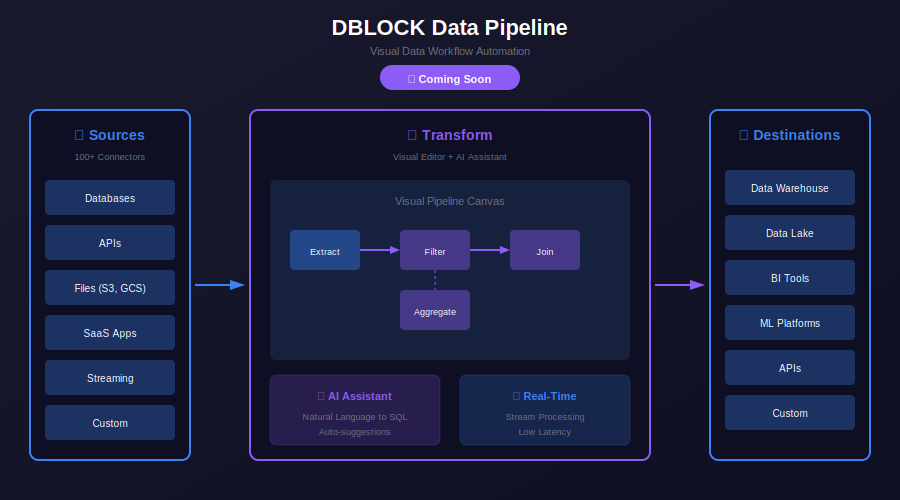

# 🏗️ DBLOCK Architecture

<p align="center">
  
  
</p>

<p align="center">
  <a href="../../README.md">🏠 Home</a> •
  <a href="../../PRODUCTS.md">📦 Products</a> •
  <a href="README.md">📖 Overview</a> •
  <a href="FEATURES.md">✨ Features</a> •
  <a href="ROADMAP.md">🗺️ Roadmap</a>
</p>

---

## Overview

This document describes the system architecture of **DBLOCK**, DigiTransLab's data workflow automation platform. DBLOCK is designed with a modular, scalable architecture that enables organisations to build, deploy, and manage sophisticated data pipelines through an intuitive visual interface.

---

## 📊 Pipeline Architecture Diagram

<p align="center">
  
</p>

<p align="center">
  <em>Figure 1: DBLOCK Pipeline Architecture and Data Flow</em>
</p>

---

## 🧩 System Components

DBLOCK consists of several interconnected components that work together to provide comprehensive data workflow automation capabilities:

### Core Components

| Component | Description |
|-----------|-------------|
| **Visual Editor** | The central design interface that enables users to create and modify data pipelines through drag-and-drop interactions. Supports complex transformations, branching logic, and parallel processing without requiring code. |
| **Connector Hub** | Manages connections to 100+ data sources and destinations. Provides standardised interfaces for databases, data warehouses, cloud storage, APIs, and streaming platforms. |
| **Execution Engine** | The orchestration layer that executes data pipelines. Manages workflow state, handles error recovery, and coordinates data movement across integrated systems. |
| **AI Assistant** | Intelligent assistance module that provides pipeline design suggestions, transformation recommendations, and automated optimisation based on data patterns and usage. |

### Supporting Components

| Component | Description |
|-----------|-------------|
| **Data Catalogue** | Maintains metadata about data sources, schemas, and lineage. Enables discovery and understanding of available data assets across the organisation. |
| **Scheduler** | Manages pipeline execution schedules, triggers, and dependencies. Supports cron-based scheduling, event-driven triggers, and manual execution. |
| **Monitoring Dashboard** | Provides real-time visibility into pipeline execution, performance metrics, and data quality indicators. |
| **Configuration Manager** | Manages system settings, connection credentials, and pipeline configurations with secure storage and version control. |

---

## 🔄 Data Flow

The following describes how data flows through the DBLOCK system from source ingestion to destination delivery:

### 1. Data Ingestion

```
┌─────────────────────────────────────────────────────────────────┐
│                        Data Sources                              │
├─────────────┬─────────────┬─────────────┬─────────────┬─────────┤
│  Databases  │   Cloud     │  Streaming  │    APIs     │  Files  │
│ (PostgreSQL,│  Storage    │   (Kafka,   │   (REST,    │  (CSV,  │
│   MySQL)    │ (S3, GCS)   │   Kinesis)  │   GraphQL)  │  JSON)  │
└──────┬──────┴──────┬──────┴──────┬──────┴──────┬──────┴────┬────┘
       │             │             │             │           │
       └─────────────┴─────────────┴─────────────┴───────────┘
                                   │
                                   ▼
                        ┌─────────────────────┐
                        │    Connector Hub    │
                        │  (Standardisation)  │
                        └──────────┬──────────┘
                                   │
                                   ▼
```

Data is collected from various sources through the **Connector Hub**, which standardises data formats and handles connection management for consistent processing.

### 2. Transformation Processing

```
                        ┌─────────────────────┐
                        │  Execution Engine   │
                        ├─────────────────────┤
                        │ • Data Validation   │
                        │ • Transformations   │
                        │ • Enrichment        │
                        │ • Aggregation       │
                        └──────────┬──────────┘
                                   │
                    ┌──────────────┼──────────────┐
                    │              │              │
                    ▼              ▼              ▼
              ┌──────────┐  ┌──────────┐  ┌──────────┐
              │  Filter  │  │   Join   │  │ Aggregate│
              │  & Map   │  │  & Merge │  │ & Window │
              └────┬─────┘  └────┬─────┘  └────┬─────┘
                   │             │             │
```

The **Execution Engine** processes data through user-defined transformations, including filtering, mapping, joining, and aggregation operations.

### 3. AI-Assisted Optimisation

```
                        ┌─────────────────────┐
                        │    AI Assistant     │
                        ├─────────────────────┤
                        │ • Schema Inference  │
                        │ • Query Optimisation│
                        │ • Pattern Detection │
                        │ • Recommendations   │
                        └──────────┬──────────┘
                                   │
                    ┌──────────────┼──────────────┐
                    │              │              │
                    ▼              ▼              ▼
              ┌──────────┐  ┌──────────┐  ┌──────────┐
              │ Pipeline │  │  Data    │  │ Resource │
              │ Suggest  │  │ Quality  │  │ Scaling  │
              └──────────┘  └──────────┘  └──────────┘
```

The **AI Assistant** analyses pipeline patterns and data characteristics to provide intelligent suggestions for optimisation and improvement.

### 4. Data Delivery

```
                        ┌─────────────────────┐
                        │   Output Manager    │
                        ├─────────────────────┤
                        │ • Format Conversion │
                        │ • Batch Delivery    │
                        │ • Stream Publishing │
                        │ • API Exposure      │
                        └──────────┬──────────┘
                                   │
                    ┌──────────────┼──────────────┐
                    │              │              │
                    ▼              ▼              ▼
              ┌──────────┐  ┌──────────┐  ┌──────────┐
              │   Data   │  │ Analytics│  │  Real-   │
              │Warehouses│  │ Platforms│  │  Time    │
              └──────────┘  └──────────┘  └──────────┘
```

The **Output Manager** delivers processed data to destinations in the appropriate format, supporting batch loads, streaming outputs, and API endpoints.

---

## 🔗 Connector Architecture

DBLOCK's **Connector Hub** provides connectivity to 100+ data sources and destinations:

### Connector Categories

<p align="center">
  
  
  
</p>

| Category | Connectors | Purpose |
|----------|------------|---------|
| **Databases** | PostgreSQL, MySQL, MongoDB, Oracle, SQL Server | Transactional data extraction and loading |
| **Data Warehouses** | Snowflake, BigQuery, Redshift, Databricks | Analytics and reporting destinations |
| **Cloud Storage** | AWS S3, Azure Blob, Google Cloud Storage | File-based data ingestion and archival |
| **Streaming** | Apache Kafka, AWS Kinesis, Google Pub/Sub | Real-time event processing |
| **SaaS Applications** | Salesforce, HubSpot, Stripe, Shopify | Business application integration |
| **APIs** | REST, GraphQL, SOAP, Custom webhooks | External service connectivity |

### Connector Patterns

```
┌─────────────────────────────────────────────────────────────────┐
│                       Connector Hub                              │
├─────────────────────────────────────────────────────────────────┤
│                                                                  │
│  ┌─────────────┐  ┌─────────────┐  ┌─────────────┐              │
│  │   Batch     │  │  Streaming  │  │   Change    │              │
│  │  Connector  │  │  Connector  │  │   Data      │              │
│  │             │  │             │  │   Capture   │              │
│  └──────┬──────┘  └──────┬──────┘  └──────┬──────┘              │
│         │                │                │                      │
│         └────────────────┼────────────────┘                      │
│                          │                                       │
│                          ▼                                       │
│                 ┌─────────────────┐                              │
│                 │  Schema Registry│                              │
│                 │  & Validation   │                              │
│                 └─────────────────┘                              │
│                                                                  │
└─────────────────────────────────────────────────────────────────┘
```

---

## ⚡ Real-Time Streaming Architecture

DBLOCK supports real-time data processing with built-in streaming capabilities:

### Streaming Components

| Component | Description |
|-----------|-------------|
| **Stream Ingestion** | Consumes events from streaming platforms with configurable parallelism and offset management |
| **Window Processing** | Supports tumbling, sliding, and session windows for time-based aggregations |
| **State Management** | Maintains processing state for exactly-once semantics and fault tolerance |
| **Backpressure Handling** | Automatically manages flow control to prevent system overload |

### Streaming Data Flow

```
┌─────────────────────────────────────────────────────────────────┐
│                    Real-Time Processing                          │
├─────────────────────────────────────────────────────────────────┤
│                                                                  │
│  ┌─────────────┐     ┌─────────────┐     ┌─────────────┐        │
│  │   Event     │────▶│   Stream    │────▶│   Output    │        │
│  │   Source    │     │  Processor  │     │   Sink      │        │
│  └─────────────┘     └──────┬──────┘     └─────────────┘        │
│                             │                                    │
│                             ▼                                    │
│                    ┌─────────────────┐                           │
│                    │  State Store    │                           │
│                    │  (Checkpoints)  │                           │
│                    └─────────────────┘                           │
│                                                                  │
└─────────────────────────────────────────────────────────────────┘
```

---

## 🏠 Deployment Architecture

DBLOCK supports **self-hosted** and **cloud deployment** options for flexibility and control:

### Deployment Options

| Option | Description | Use Case |
|--------|-------------|----------|
| **Single Node** | All components on one server | Development, small teams |
| **Distributed** | Components across multiple nodes | Production environments |
| **Kubernetes** | Container orchestration deployment | Enterprise scale |
| **Managed Cloud** | Fully managed service (coming soon) | Hands-off operation |

### Infrastructure Requirements

<details>
<summary><strong>📋 Minimum Requirements</strong></summary>

| Resource | Specification |
|----------|---------------|
| **CPU** | 4 cores |
| **Memory** | 16 GB RAM |
| **Storage** | 100 GB SSD |
| **Network** | 1 Gbps |
| **OS** | Linux (Ubuntu 20.04+, RHEL 8+) |

</details>

<details>
<summary><strong>📋 Recommended Requirements (Production)</strong></summary>

| Resource | Specification |
|----------|---------------|
| **CPU** | 16+ cores |
| **Memory** | 64+ GB RAM |
| **Storage** | 1+ TB SSD |
| **Network** | 10 Gbps |
| **OS** | Linux (Ubuntu 22.04, RHEL 9) |

</details>

---

## 🔒 Security Architecture

DBLOCK is built with enterprise-grade security features:

### Security Features

| Feature | Description |
|---------|-------------|
| **Encryption at Rest** | All sensitive data and credentials encrypted using AES-256 |
| **Encryption in Transit** | TLS 1.3 for all network communications |
| **Role-Based Access Control** | Granular permissions for users, teams, and pipelines |
| **Data Masking** | Automatic masking of sensitive data in logs and previews |
| **Audit Logging** | Comprehensive logging of all system activities and data access |
| **SSO Integration** | Support for SAML 2.0 and OIDC authentication |

### Data Governance

| Feature | Description |
|---------|-------------|
| **Data Lineage** | Track data flow from source to destination across all pipelines |
| **Schema Evolution** | Manage schema changes with backward compatibility |
| **Data Quality Rules** | Define and enforce data quality constraints |
| **Compliance Controls** | Built-in support for GDPR, CCPA, and industry regulations |

---

## 📖 Related Documentation

| Document | Description |
|----------|-------------|
| [Overview](README.md) | Product overview, features, and benefits |
| [Features](FEATURES.md) | Detailed feature breakdown and capabilities |
| [Roadmap](ROADMAP.md) | Development timeline and planned features |

---

## 🔗 External Resources

<p align="center">
  <a href="https://github.com/digitranslab/dblock"></a>
  <a href="https://discord.com/invite/2mK6h9rp"></a>
</p>

---

<p align="center">
  <a href="README.md">📖 Back to Overview</a> •
  <a href="../../PRODUCTS.md">📦 Back to Products</a> •
  <a href="../../README.md">🏠 Back to Home</a>
</p>

<p align="center">
  <sub>© 2024 DigiTransLab. All rights reserved.</sub>
</p>
